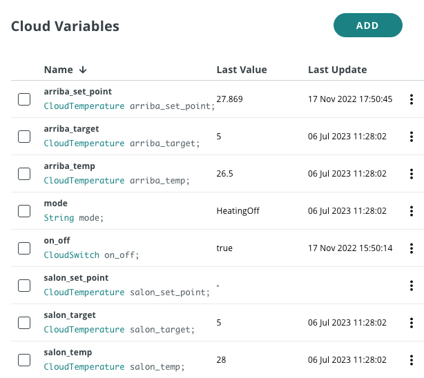
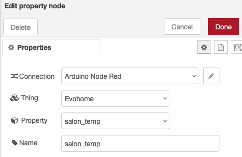
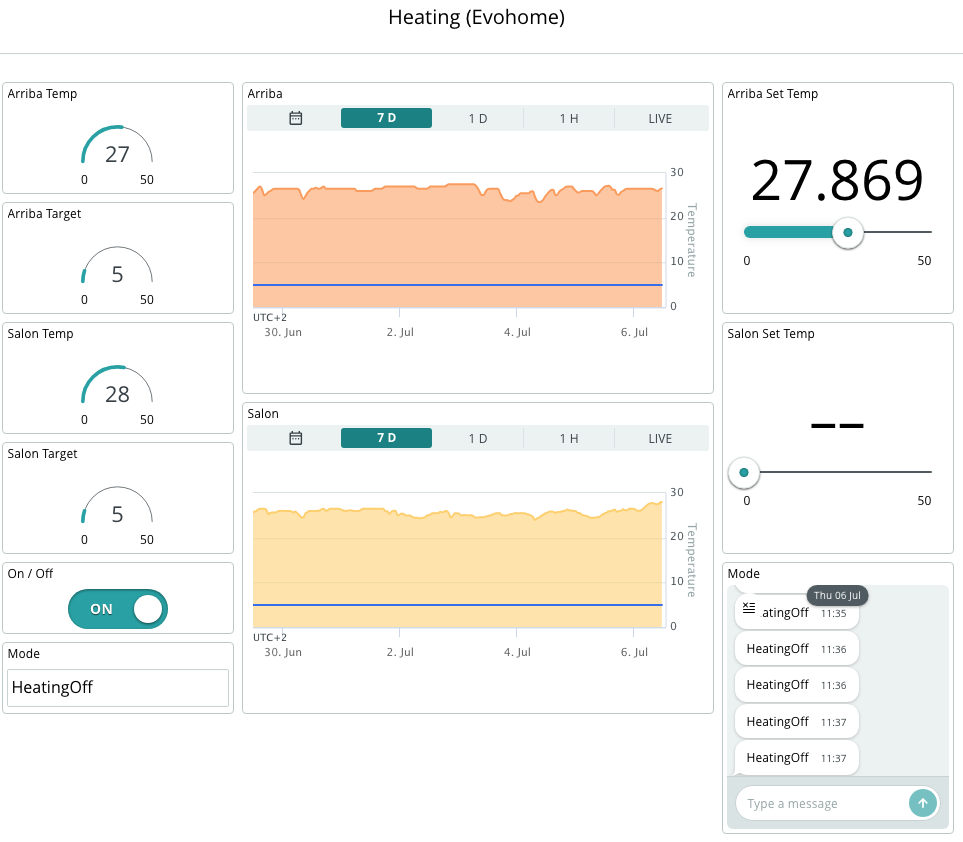
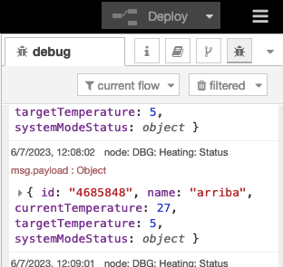

arduino-cloud-evohome-nodered
=============================

# Introduction
We're surrounded by systems in our homes that help us control and manage our environment. From controlling the heating system and monitoring the temperature to managing the lights and more, these systems make our lives easier. 

While we can control most of these systems through PC or mobile apps, they are usually locked-in and it can get sometimes not practical to have multiple applications. That's where an integrated platform comes in, offering a centralized hub for all our customized dashboards.

But additionally, sometimes, we want to combine data from different applications to trigger actions on other systems. And if you're an Arduino enthusiast like me, you'd want to integrate all of it with your Arduino projects. 

Arduino Cloud is an excellent solution for that, but integrating external platforms can be a bit tricky, especially with many commercial products lacking direct integration. That's where Node-RED comes to the rescue! It helps us redirect and manage the traffic between these commercial products and Arduino Cloud. 

This project is part of a series that I've created to showcase how I manage my home systems by integrating them with Arduino Cloud. In addition to this project, I've also worked on integrating TP Link switches and Tuya Energy meter, so you can check those out too! 

## What is Arduino Cloud?
[Arduino Cloud](https://cloud.arduino.cc) is a platform that simplifies the process of developing, deploying, and managing IoT devices. It supports various hardware, including Arduino boards, ESP32, and ESP8266 based boards, and makes it easy for makers, IoT enthusiasts, and professionals to build connected projects without coding expertise. 

The platform's IoT Cloud tool allows for easy management and monitoring of connected devices through customizable dashboards, which provide real-time visualisations of the device's data. The dashboards can be accessed remotely through the mobile app Arduino IoT Cloud Remote, which is available for both Android and iOS devices, allowing users to manage their devices from anywhere.

## What is Node-RED?
[Node-RED](https://nodered.org/) is an open-source visual programming tool designed for connecting and automating devices, services, and APIs. It provides a browser-based flow editor that allows users to create flows by dragging and dropping nodes onto a canvas and connecting them together. Each node represents a specific functionality or service, such as data input/output, data transformation, or communication with external systems. With its intuitive interface and extensive library of pre-built nodes, Node-RED enables users to quickly and easily create complex workflows without the need for traditional coding. It is particularly popular in the Internet of Things (IoT) domain, where it simplifies the integration of various sensors, devices, and cloud services, allowing users to build powerful IoT applications and automation systems.

## What is Honeywell Evohome?
[Honeywell Evohome](https://www.resideo.com/gb/en/solutions/home-comfort/evohome/) is a smart home heating system that offers individual room control for optimal comfort and energy efficiency. It consists of a central control unit, wireless radiator controllers, and a mobile app for remote control. Evohome allows users to create customized heating schedules for each room or zone in their home, enabling precise temperature control and eliminating energy waste. The system utilizes wireless communication to communicate with the radiator controllers, providing flexibility in installation and control. With features like geofencing and adaptive learning, Evohome intelligently adjusts heating settings based on occupancy and user preferences, ultimately providing a convenient and cost-effective heating solution for homeowners.

# Pre-requisites
You need:
* a Honeywell Evohome system
* an Arduino Cloud account (https://cloud.arduino.cc)
* an instance of Node-RED (running on a local or Cloud machine). You can find more information about how to install Node-RED [here](https://nodered.org/docs/getting-started/local).

You don't need:
* any Arduino, ESP32 or ESP8266 devices

# The process 
1. Get your Honeywell getconnected credentials 
2. Create the Device and Thing in the Arduino Cloud
3. Create the Node RED flow 
4. Create the Arduino Cloud Dashboard 
5. Test everything 

## Get your Honeywell getconnected credentials
The process is very straightforward. You just have to create a Honeywellhome developer account and create an application.
1. https://developer.honeywellhome.com
2. Sign up (if you don't have an account yet)
3. Log in and go to the tab "MY APPS"
4. Click on "CREATE NEW APP"
5. Introduce a name ("App Name")
6. Introduce a callback URL
*Note: You can use `http://localhost` if you don't have any*
7. Get your key and secret. We will use it later on.

Full Honeywell documentation [here](https://developer.honeywellhome.com/api-methods)

## Create the Device in the Arduino Cloud
### Create the Device 
Go to the [Devices](https://create.arduino.cc/iot/devices) section of the Arduino IoT Cloud and click on ADD. 
Select "Any Device" and follow the instructions on the wizard.
*Note: Save your `Device ID` and `Secret Key`. We are not going to use them (as we will use the API key), but it can be helpful for other use cases.*

### Create the Thing 
In the Devices list, find the device you just created and click on "CREATE THING" and assign a name to it.

### Create the Variables 
**Important Note**: Every EvoHome setup is different. You may have several temperature sensors, set points, actions, etc. So, you will have to adjust the following instructions to your own setup.
In my case, I have two zones, each with an electrovalve controlled by a thermostat. The zones have the names: 'salon' and 'arriba'.

Each zone has:
* The current temperature
* A set point temperature

For the set point, we will need two variables. The first one will hold the information read from the platform (\<zone\>_target). The second one is the set point that we can define (\<zone\>_set_point).

Add the variables clicking on the ADD button. At the end of the process, your list of variables should look like this 

|Name   |Type   |Description   |
|---|---|---|
|arriba_set_point|CloudTemperature|The set point that you can set for zone 'arriba'| 
|arriba_target|CloudTemperature|The current set point read from EvoHome for zone 'arriba'|
|arriba_temp|CloudTemperature|The current temperature read from EvoHome for zone 'arriba'|
|salon_set_point|CloudTemperature| The set point that you can set for zone 'salon'|
|salon_target|CloudTemperature| The current set point read from EvoHome for zone 'salon'|
|salon_temp|CloudTemperature| The current temperature read from EvoHome for zone 'salon'|
|mode|String|Mode read from EvoHome|
|on_off|CloudSwitch|The action we want to do on the system|

This is a screenshot for reference.

### Get an Arduino Cloud API key
Go to https://cloud.arduino.cc/home/api-keys.
Click on "CREATE API KEY", enter a name.
Note down the Client ID and Client Secret or download the PDF. We will use these credentials in the Node-RED node.

## Create the Node-RED flow
Access your Node-RED instance (typically `http://<YOUR_IP>:1880`) and import the code:
1. Select `Import` in the menu
   a. Paste the code that you can find in [flows.json](https://github.com/dbduino-prjs/arduino-cloud-evohome-nodered/blob/develop/flows.json) in the github project
   b. Click on `Import`
2. Configure the EvoHome nodes using the Honeywell API key that you created earlier
3. Configure the Arduino Cloud nodes
   a. Configure your connection with the Arduino Cloud API key that you created in the previous section  
   b. Introduce your Thing and property

1. Click on Deploy (top right corner of the screen)

## Create the Arduino Cloud dashboard
Go to the Dashboards section and click on CREATE. 
You can create the widget as you wish. Here you have a screenshot of mine as a reference:

## Let's test the system
And that's it.
Now it is time to go to your Arduino Cloud dashboard and see the evolution of the temperature and perform the desired actions.

## Final considerations
### Troubleshooting
Check the logs to see if the nodes are working.

